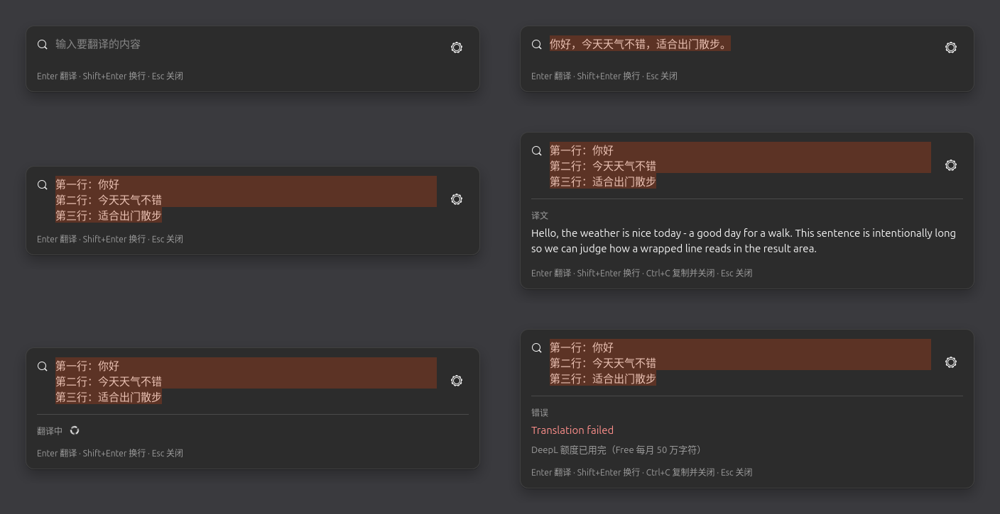

# DeepL 快捷翻译（Ubuntu GNOME）


> A minimal DeepL popup translator for Ubuntu GNOME: press `Ctrl+Alt+Space`, the clipboard is
> already in the box, `Enter` translates, `Ctrl+C` copies the result and closes.

为 **Ubuntu 26.04 LTS + GNOME 50 + Wayland** 写的极简桌面翻译工具。常驻后台，
`Ctrl + Alt + Space` 唤出一张 Spotlight 风格的小卡片，自动带出剪贴板内容，
`Enter` 翻译，`Ctrl + C` 复制译文并关窗——比开浏览器快。



## 特性

- **一键唤起**：无边框卡片，自动居中，失焦自动隐藏；窗口只隐藏不退出，进程常驻。
- **剪贴板即输入**：唤起时把剪贴板文本填进输入框并整体选中，直接键入即替换；
  复制文件（剪贴板里其实是路径）不会被误当成待翻译文本。
- **中英互译**：中文 → 英语、英语 → 中文；其他语言或混合文本交给 DeepL 自动检测。
- **键盘全程可用**：`Enter` 翻译、`Shift+Enter` 换行、`Ctrl+C` 复制译文并关闭、`Esc` 关闭。
- **中文输入法友好**：组合期间 `Enter` 只用于确认候选词；并处理了"热键按键泄漏导致
  窗口自动冒空格"这类合成器层面的坑（详见规格 FR-WINDOW-7）。
- **隐私**：API Key 存进 GNOME 密钥环，不落盘；日志里不出现 Key、待翻译文本与剪贴板内容。
- **单实例**：第二次启动只是把命令转交给主实例，不会出现两个窗口。

## 安装

### 依赖

只在 Ubuntu 26.04 LTS / GNOME 50 / Wayland 上实测通过。

| 包 | 用途 |
| --- | --- |
| `python3`（≥ 3.10） | 运行时 |
| `python3-gi`、`gir1.2-gtk-4.0`、`gir1.2-adw-1` | GTK4 + libadwaita 界面 |
| `gir1.2-secret-1` | 把 API Key 存进系统密钥环 |
| `python3-httpx` | 调用 DeepL HTTP API |
| `libglib2.0-bin` | `gdbus`，命令行启用主实例的快路径 |

用 `apt install ./*.deb` 安装时会自动拉齐这些依赖。

### 用 .deb 安装

```sh
./packaging/build-deb.sh                             # 产物在 dist/
sudo apt install ./dist/deepl-quick-translate_*.deb
deepl-quick-translate --set-api-key                  # 写入 DeepL API Key（输入不回显）
```

装好后应用菜单里会出现「DeepL 快捷翻译」，可用 `Ctrl+Alt+Space` 唤起。

> `build-deb.sh` 直接组装目录树后用 `dpkg-deb` 打包，不需要 `dpkg-buildpackage` 或
> `debhelper`，因此不引入构建期依赖。

### 从源码运行

```sh
git clone https://github.com/PanWenzheng/deepl-quick-translate.git
cd deepl-quick-translate
./tools/dev-install.sh          # 把 .desktop 装到用户目录（门户识别应用身份的硬依赖）
./run.sh --background           # 后台常驻，等待快捷键
./run.sh --toggle               # 唤起窗口
./run.sh --quit                 # 退出并注销快捷键
```

装了 `.deb` 之后要清掉开发副本，否则用户级 `.desktop` 会盖住系统级那份：

```sh
./tools/dev-install.sh --remove
```

## 使用

| 操作 | 效果 |
| --- | --- |
| `Ctrl + Alt + Space` | 唤起 / 隐藏窗口（可在设置里改） |
| `Enter` | 翻译输入框内容 |
| `Shift + Enter` | 输入换行 |
| `Ctrl + C` | 译文已显示且输入框没选中文字时：复制译文（默认随后关窗） |
| `Esc` | 关闭窗口（进程继续常驻） |
| 右上角齿轮 | 打开设置（通用 / DeepL 两页） |

设置窗口里可以改快捷键、是否随登录自启动、复制后是否关窗、失去焦点是否隐藏，
以及 DeepL 的 API Key、Endpoint（Free / Pro / 自定义）与「测试连接」
（走 `GET /v2/usage`，不消耗翻译额度）。

## API Key

两种方式，按需选一种：

```sh
deepl-quick-translate --set-api-key     # 存进 GNOME 密钥环（推荐）
export DEEPL_API_KEY=xxxxxxxx:fx        # 或只读环境变量兜底（不会写入任何文件）
```

`--api-key-status` 查看状态，`--clear-api-key` 从密钥环删除。

## 命令行

```sh
deepl-quick-translate [选项]
  --toggle          唤起翻译窗口（默认）
  --background      后台启动，不开窗口（自启动用）
  --settings        打开设置窗口
  --quit            退出正在运行的实例（含注销快捷键）
  --verbose         输出调试日志
  --version         显示版本
  --set-api-key / --api-key-status / --clear-api-key
```

配置文件在 `~/.config/io.github.panwenzheng.DeepLQuickTranslate/config.json`（只放非敏感项），
自启动文件为 `~/.config/autostart/deepl-quick-translate.desktop`。

## 已知边界

- 仅支持 Ubuntu 26.04 LTS / GNOME 50 / Wayland；未支持 X11、KDE、Windows、macOS。
- 语言方向用本地简单规则判定（"拉丁字母为主即英文"，其余交给 DeepL 自动检测），
  因此 `Bonjour` 会被当成英文；多语种场景需要更好的检测，属于 V2。
- 不做本地词典、翻译历史、多引擎对比、OCR、TTS、托盘图标。
- 应用图标是简洁的占位 SVG（见规格 Q6），欢迎替换。

## 开发

```sh
python3 -m unittest discover -s tests   # 单元测试（标准库 unittest，无第三方测试依赖）
./packaging/build-deb.sh                # 打包
tools/portal_probe.py                   # XDG 门户诊断脚本（排查快捷键后端问题用）
```

实测结论与设计取舍都写在规格说明书里：

- [docs/SPEC.md](docs/SPEC.md)：需求条目（FR-*）、验收清单（T1–T26）、
  附录 A 与原始需求文档的差异对照、附录 B DeepL 官方文档核对结论、
  附录 C XDG 门户实测结论。
- 调试注意：如果环境预设了 `GDK_BACKEND=x11`，程序会跑在 XWayland 上，
  这时显式指定后端——`GDK_BACKEND=wayland ./run.sh --background --verbose`，
  日志里的 `display backend` 会说明实际用的是哪个。

## 免责声明

本项目不是 DeepL 官方项目，与 DeepL SE 无任何关联；DeepL 是 DeepL SE 的商标。
使用前请在 DeepL 官网申请 API Key，翻译请求受其服务条款与额度限制
（Free 账户每月 50 万字符）。

## 许可证

[MIT](LICENSE) © 2026 Pan Wenzheng、DeepSeek

## 作者

- [Pan Wenzheng](https://github.com/PanWenzheng)
- DeepSeek（协作开发：代码、文档与实测记录）
